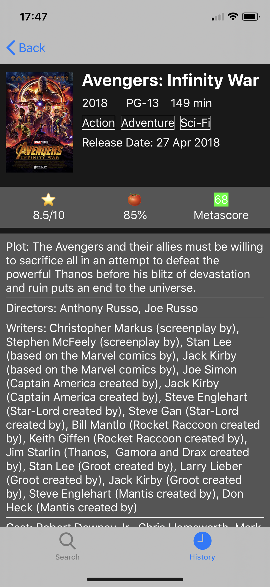
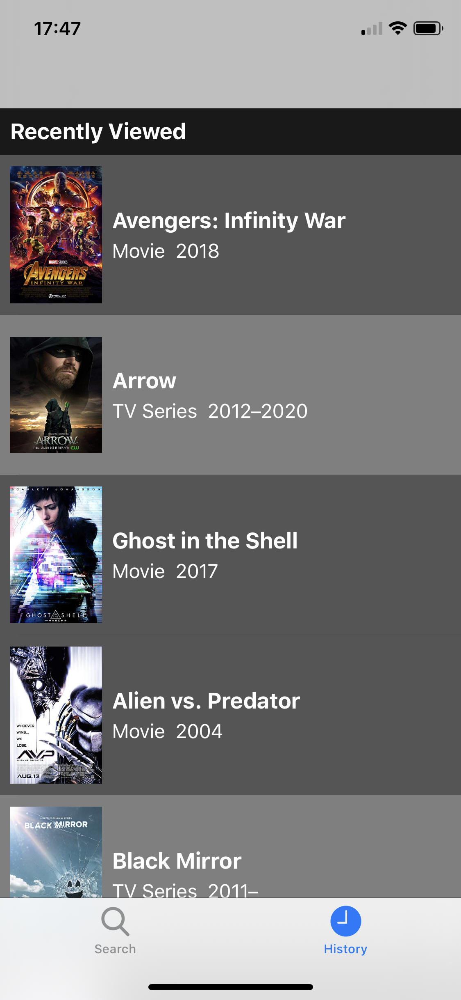
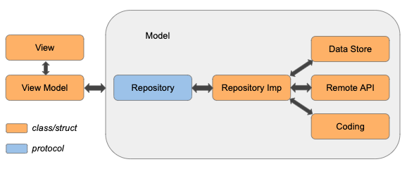

# MovieDevotee
Movie Devotee searches IMDb database for movies and TV shows.
## Features
* Seach for movies and TV shows by title
* View movie details
* View recently searched items

   

## App Architecture
### Dependency Injection
A container is responsible for injecting dependencies into every objects in the module then return its view controller and navigation.
* App Dependency Container: contains all long-lived dependencies. The container lives as long as the app lives, held by AppDelegate.
* Module Dependency Container: contains module-level dependencies, takes App Dependency Container as init parameter. The container lives as long as the view controller lives, held by View Model through Navigation class-bound protocol.
### MVVM
MVVM is used to decouple views from models.
### Repository Pattern
The repository pattern provides facades for networking, persistence and in-memory caching, which are responsible for CRUD operations. When combined with MVVM, view models use these repository facades, instead of performing these operations themselves.
\

## Built with
* [RxSwift](https://github.com/ReactiveX/RxSwift)
* [Realm Database](https://github.com/realm/realm-cocoa)
* [RxRealm](https://github.com/RxSwiftCommunity/RxRealm)
* [Alamofire](https://github.com/Alamofire/Alamofire)
* [SwiftyJSON](https://github.com/SwiftyJSON/SwiftyJSON)
* [MagazineLayout](https://github.com/airbnb/MagazineLayout)
* [SDWebImage](https://github.com/SDWebImage/SDWebImage)
